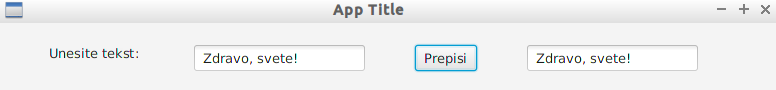

\vspace{2mm}
**INFO:** Ispit se sastoji iz dve celine `Scala` i `Prolog` po dva zadatka.


**NAPOMENA:** Virtuelnu mašinu sa potrebnim softverom možete preuzeti sa sledećeg linka:

 [https://drive.google.com/file/d/12uPc_a6P1Tc26LeiugR9L4TjADrCXhnu/view](https://drive.google.com/file/d/12uPc_a6P1Tc26LeiugR9L4TjADrCXhnu/view)
\newpage

# Deo 1 - Scala
## InteliJ razvojno okruženje
Koristimo `InteliJ Idea` kao razvojno okruženje.

### Program - Zdravo, Svete (Scala)
Projekat se kreira:

1. `file > new > project > sbt`
2. Unese se ime projekta npr. `Zadatak1`, ubuduće `Project_dir`
3. Vaše rešenje treba da se nalazi u direktorijumu projekta: `Project_dir > src > main > scala`
5. Treba da napravite novi objekat koji sadrzi `main()` metod u: `Project_dir > src > main > scala`
6. Napravire novi objekat: `New > Scala Class > Type: Object`
7. Unutar njega definišete metod `main()`:

```{.scala caption="Zdravo, svete!"}
object ZdravoSvete {
    def main(args: Array[String]): Unit = {
        println("Zdravo, svete!")
    }
}
```
`Alt+Shift+F10` je prečica za Run, pritisnite `Alt+Shift+F10`
```
Zdravo, svete!
```
\newpage

## 1. Zadatak [Scala - Niti]
### Niti (threads)
Da bismo napravili nit potrebno je da definišemo klasu koja nasleđuje klasu `Thread` i implementiramo metod `run()` čije izvrsavanje počinje kada nad instancom nase klase pozovemo metod `start()`.

```{.scala caption="Niti"}
class Nit extends Thread {
    override def run() {
        println("Zdravo iz niti: " + this.getId())
    }
}
object ZdravoNiti {
    def main(args : Array[String]): Unit = {
        /* Kreiramo 4 niti */
        val niti : Array[Nit] = Array.fill(5)(new Nit())

        /* Pocinjemo izvrsavanja iz razlicitih niti */
        for (nit <- niti) nit.start()
        println("Zdravo iz main-a")

        /* Cekamo niti da zavrse izvrsavanje */
        for (nit <- niti) nit.join()
        println("Niti zavrsile sa izvrsavanjem.")
    }
}
```
```
Zdravo iz niti: 9
Zdravo iz main-a
Zdravo iz niti: 10
Zdravo iz niti: 11
Zdravo iz niti: 12
```

### Konkurentno izvršavanje kritične sekcije koda

Synchronized kljucna rec obelezava kriticnu sekciju
i garantuje se da u svakom trenutku tacno jedna nit moze izvsavati naredbe iz bloka.
Synchronized se moze koristiti na više načina:
```{.scala caption="Synchronized"}
// 1. Nacin - Metodi klase
def f() = synchronized { teloFunkcije }
// Metod f jedne instance nase klase je kriticna sekcija

// 2. Nacin - instanca.synchronized { blok }
// var mapa je tipa ConcurrentHashMap[Char, Int]()
mapa.synchronized {
    mapa.put('a', 1) // Postavimo 'a' na 1 
    mapa.put('b', 2) // Postavimo 'a' na 2 
}
// Menja vrednost na 'a' sa vrednoscu na 'b'
mapa.synchronized {
    mapa.replace('a', mapa.get('b'))
}

```
\newpage

### Java FX (Gui)

```{.scala caption="Gui aplikacija koja prepisuje iz jednog TextField elementa u drugi" label="lst:jfxprepis"}
import javafx.application.Application
import javafx.scene.Scene
import javafx.stage.Stage
import javafx.scene.layout._
import javafx.scene.control._
import javafx.geometry._

class GuiAplikacija extends Application {
    override def start(primaryStage: Stage) {
         primaryStage.setTitle("App Title")
         /* VBox - dodavajem dece nizemo elemente jedan ispod drugog,
          * kao argument (50) prosledjujemo razmak izmedju dece */
         val root = new VBox(50)
         root.setAlignment(Pos.CENTER)
         root.setPadding(new Insets(50, 50, 50, 50))

         /* Hbox - isto kao VBox samo horizontalno */
         val hbox = new HBox(50) // 50 je razmak izmedju dece
         val lbl = new Label("Unesite tekst: ")
         val tf1 =  new TextField()
         val btn = new Button("Prepisi")
         val tf2 =  new TextField()
         hbox.getChildren.addAll(lbl, tf1, btn, tf2)

         /* Dodajemo hbox u listu dece root-a */ 
         root.getChildren.add(hbox)

         /* Akcije */
         btn.setOnAction(e => {
         tf2.setText(tf1.getText())
         })

         primaryStage.setScene(new Scene(root, 800, 600))
         primaryStage.show() // Ne zaboraviti prikaz scene!!
  }
}
object MojaAplikacija {
    def main(args: Array[String]) = {
        Application.launch(classOf[GuiAplikacija], args: _*)
    }
}
```



\newpage

## 2. Zadatak [Scala - Spark]
### Podešavanje `Scala (Apache) Spark`:
Pre nego što počnete sa radom, potrebno je izmeniti fajl `build.sbt`
```scala
name := "Zadatak2"
version := "0.1"
scalaVersion := "2.12.8"

// Potrebno je dodati sledece:
val sparkVersion = "2.4.0"
libraryDependencies ++= Seq(
    "org.apache.spark" %% "spark-core" % sparkVersion
)
```
* Snimite build.sbt fajl.
* Nakon izvršenih izmena, dok se još nalazite u build.sbt u gornjem desnom uglu kliknite na `import project`. 

**Spremni ste za pisanje 2. zadatka!!**

### Kostur za 2. zadatak

Napravite novi objekat sa proizvoljnim imenom `ImeObjekta`:
```{.scala caption="Scala Spark"}
object ImeObjekta {
    def main(args: Array[String]): Unit = {
        val conf = new SparkConf()
            .setAppName("Aplikacija")
            .setMaster("local[4]") // 4threada

        val sk = SparkContext(conf)
        val datRDD=sk.textFile("ulaz.txt")

        val result = datRDD.Metod1()
                           .Metod2() // ... Niz transformacija

        sk.stop()
        print("Rezultat: ")
        println(result)
    }
}
```

## Scala - dodatak
```{.scala caption="Razni primeri" label="lst:razni"}
val matrica1 = ofDim[Int](n,m) // Visedim niz n x m
Thread.sleep(1000) // Spava 1s
ThreadLocalRandom.current().nextInt(1,10) // Random broj iz [1, 10) 
```
\newpage

# Deo 2 - Prolog
