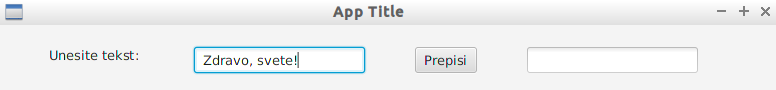

Zadaci: ispit se sastoji iz dve celine `Scala` i `Prolog` po dva zadatka.

#### Scala  
*1. zadatak:* Scala [Niti]  
*2. zadatak:* [Spark]  

#### Prolog
*3. zadatak:* Prolog [-]  
*4. zadatak:* Prolog [Ogranicenja]  

## Deo 1. - Scala
### InteliJ razvojno okruženje
Koristimo `InteliJ Idea` kao razvojno okruženje.

#### Program - Zdravo, Svete (Scala)
Projekat se kreira:

1. `file > new > project > sbt`
2. Unese se ime projekta npr. `Zadatak1`, ubuduće `Project_dir`
3. Vaše rešenje treba da se nalazi u automatski kreiranom direktorijumu projekta: `Project_dir > src > main > scala`
5. Treba da napravite novi objekat koji sadrzi `main()` metod na lokaciji: `Project_dir > src > main > scala`
6. Napravire novi objekat: `New > Scala Class > Type: Object`
7. Unutar njega definišete metod `main()`:

```scala
object ZdravoSvete {
  def main(args: Array[String]): Unit = {
    println("Zdravo, svete!")
  }
}
```
- `Shift+F10` je prečica za Run, pritisnite `Shift+F10`
```
Zdravo, svete!
```

### 1. Zadatak
#### Niti (Threads)
Da bismo napravili nit potrebno je da definišemo klasu koja nasleđuje klasu `Thread` i implementiramo metod `run()` čije izvrsavanje počinje kada nad instancom nase klase pozovemo metod `start()`.

```scala
class Nit extends Thread {
  override def run() {
    println("Zdravo iz niti: " + this.getId())
  }
}

object ZdravoNiti {
  def main(args : Array[String]): Unit = {
    /* Kreiramo 4 niti */
    val niti : Array[Nit] = Array.fill(5)(new Nit())

    /* Pocinjemo izvrsavanja iz razlicitih niti */
    for (nit <- niti) nit.start()
    println("Zdravo iz main-a")

    /* Cekamo niti da zavrse izvrsavanje */
    for (nit <- niti) nit.join()
    println("Niti zavrsile sa izvrsavanjem.")
  }
}
```
```
Zdravo iz niti: 9
Zdravo iz main-a
Zdravo iz niti: 10
Zdravo iz niti: 11
Zdravo iz niti: 12
```

#### Java FX (Gui)
**Primer:** Gui aplikacija koja prepisuje iz jednog TextField elementa u drugi:
```scala
import javafx.application.Application
import javafx.scene.Scene
import javafx.stage.Stage
import javafx.scene.layout._
import javafx.scene.control._
import javafx.geometry._


class GuiAplikacija extends Application {

  override def start(primaryStage: Stage) {
      primaryStage.setTitle("App Title")
      /* VBox - dodavajem dece nizemo elemente jedan ispod drugog,
       * kao argument (50) prosledjujemo razmak izmedju dece */
      val root = new VBox(50)
      root.setAlignment(Pos.CENTER)
      root.setPadding(new Insets(50, 50, 50, 50))

      /* Hbox - isto kao VBox samo horizontalno */
      val hbox = new HBox(50) // 50 je razmak izmedju dece
      val lbl = new Label("Unesite tekst: ")
      val tf1 =  new TextField()
      val btn = new Button("Prepisi")
      val tf2 =  new TextField()
      hbox.getChildren.addAll(lbl, tf1, btn, tf2)

      /* Dodajemo hbox u listu dece root-a */ 
      root.getChildren.add(hbox)

      /* Akcije */
      btn.setOnAction(e => {
        tf2.setText(tf1.getText())
      })

      primaryStage.setScene(new Scene(root, 800, 600))
      primaryStage.show() // Ne zaboraviti prikaz scene!!
  }
}

object Vezbanje_05 {
  def main(args: Array[String]) = {
    Application.launch(classOf[GuiAplikacija], args: _*)
  }
}
```
**Izlaz:**





Klikom na dugme prepisi:


### 2. Zadatak
#### Podešavanje `Scala (Apache) Spark`:
Pre nego što počnete sa radom, potrebno je izmeniti fajl `build.sbt`
```
name := "Zadatak2"
version := "0.1"
scalaVersion := "2.12.8"

// Potrebno je dodati sledece:
val sparkVersion = "2.4.0"
libraryDependencies ++= Seq(
   "org.apache.spark" %% "spark-core" % sparkVersion
)
```
* Snimite build.sbt fajl.
* Nakon izvršenih izmena, dok se još nalazite u build.sbt u gornjem desnom uglu kliknite na `import project`. 

**Spremni ste za pisanje 2. zadatka!!**

#### Kostur za 2. zadatak

Napravite novi objekat sa proizvoljnim imenom `ImeObjekta`:
```scala
object ImeObjekta {
  def main(args: Array[String]): Unit = {
    val conf = new SparkConf()
        .setAppName("Aplikacija")
        .setMaster("local[4]") // 4threada

    val sk = SparkContext(conf)
    val datRDD=sk.textFile("ulaz.txt")

    val result = datRDD.Metod1()
                       .Metod2() // ... Niz transformacija

    sk.stop()
    print("Rezultat: ")
    println(result)
  }
}

```

## Deo 2. - Prolog
